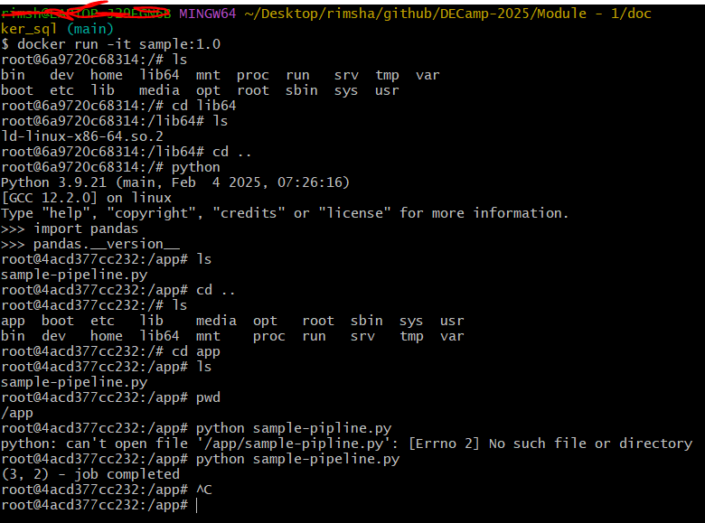

### DE Zoomcamp 1.2.1 - Introduction to Docker 

[YT link](https://www.youtube.com/watch?v=EYNwNlOrpr0&list=PL3MmuxUbc_hJed7dXYoJw8DoCuVHhGEQb&index=6)

Docker - delivers software in containers.
You can run data pipelines in docker - based on what the dependencies are.. you can use/customize different containers. You don't have to install anything on the Host Computer. 
Ex. You can run PostgreSQL DB within/inside docker, and it will not interfere with the DB installed in your computer/ or other DB's running in the same pipeline-container. 

Docker image - snapshot of your container 
Kubernetes (K8s) is an open source system to deploy, scale, and manage containerized applications anywhere.
You can run the image in GC Kubernetes, AWS Batch etc. 

Why use Docker?
- Reproducible.
- Serverless 
- Local experimentation 

Example - Running a dockerfile - specifying dependency which is pandas (since python:3.9 in dockerhub doesn't contain the pandas library)

docker run -it --entrypoint=bash python:3.9 
''' opens bash
ls to check for all the files in the container.. can install libs needed. 
if you type "python" - you'll get py prompt again  
import pandas 
pandas.__version__ prints pandas version -> installation confirmed'''

when you exit and rerun above command, pandas is lost, so you create your own Dockerfile, hence a custom image containing the pandas lib. (Module 1/docker_sql/Dockerfile) 

docker build -t sample:1.0 . 

above command runs a docker image  
(.) specifies the directory (current)
and runs the dockerfile found in that folder - naming the image sample:1.0 (tag-version). 

first command to build Dockerfile that performs simple base run of python:3.9 and install pandas 
second command to build Dockerfile that runs the sample-pipeline.py (simple py code) as well. 

notice the app folder created inside container as per instructions provided in the Dockerfile 

Note:
- WORKDIR ~ cd 
- Docker Commands:
    - docker images - display all images 
    - docker ps  - display all containers
    - docker desktop start 
    - docker desktop end 
    - docker pull {name}:{tag} - to download an image 
    - docker build -t/--tag {name}:{tag} - to "build" the Dockerfile, i.e. create docker image file 
        - "-t/--tag" to name the docker image
    - docker run -d --name {name}:{tag} - to run the container 
        - "-d" detaches the container from cmd line, so exiting will not close the container
        - "--name" to set a name for the container
    - docker start {container_id}/{container_name}
    - docker stop {container_id}/{container_name}  

- You can always do docker run without docker pull, because if the image is not found locally, it will automatically download it from the registry. 
- Running docker ps will giive you container_id and container_name

### DE Zoomcamp 1.2.2 - Ingesting NY Taxi Data to Postgres

[YT Link](https://www.youtube.com/watch?v=2JM-ziJt0WI&list=PL3MmuxUbc_hJed7dXYoJw8DoCuVHhGEQb&index=6)

Docker Compose - Running multiple docker images. 
