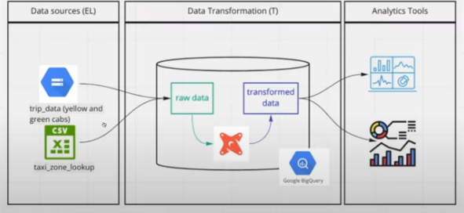
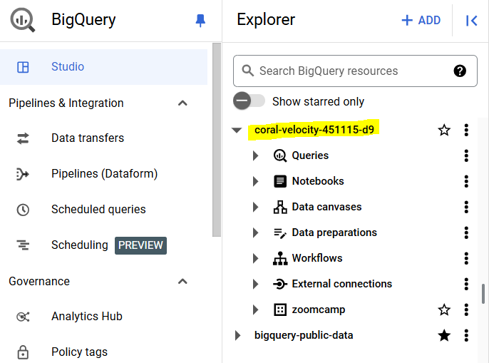
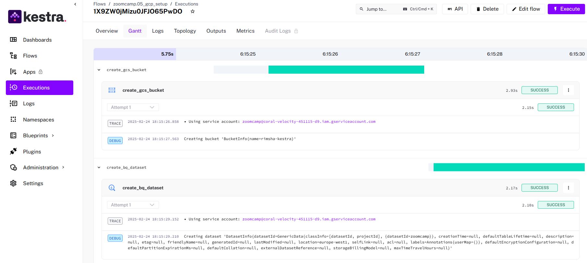
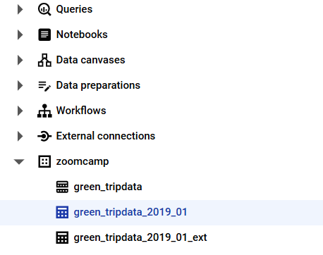
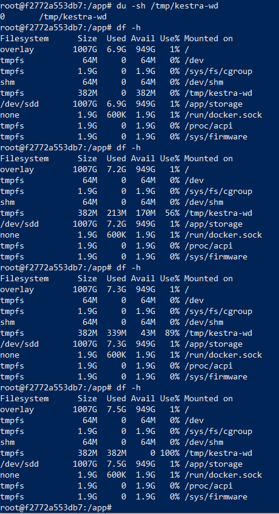

## Table of Contents


### DE Zoomcamp 2.2.1 - Workflow Orchestration Introduction

Workflow *orchestration* is similar to an orchestra will several different instruments playing. And the orchestraion is done by a *conductor* who oversees and assigns tasks. 

What is Kestra?
All in one automation and orchestration platform to perform ETL, schedule workflows, run batch pipelines or event driven pipelines.. has seamless API integration capabilities. You can also monitor your pipelines effectively. 
You can control your workflow in:
- No code 
- Low code
- Full code

What we will cover in the nest few lectures?
- Intro to Kestra 
- ETL - with postgres 
- ELT - with google cloud 
- Parameterizing exec 
- Scheduling workflows + backfills 
- Install kestra on cloud and sync workflows with git

### DE Zoomcamp 2.2.2 - Learn Kestra

1. [Getting Started with Kestra in 15 minutes](https://www.youtube.com/watch?v=a2BZ7vOihjg) 
2. [Kestra Beginner Tutorial (2024)](https://www.youtube.com/playlist?list=PLEK3H8YwZn1oaSNybGnIfO03KC_jQVChL)    

**Docker Command to download kestra** 

```
docker run --pull=always --rm -it -p 8080:8080 --user=root \
-v /var/run/docker.sock:/var/run/docker.sock \
-v /tmp:/tmp kestra/kestra:latest server local
```

This will start kestra on localhost:8080

- Kestra workflows are called `Flows`
- They're defined in yaml.
- Works with any languages. 
- Each flow has three key properties:
    - id - unique identifier for each 'flow'.
    - namespace - env you're task is running in
    - tasks - have serperate properties, must have id and type. 

**How to use inputs?**
Constant values. Set before task definition. Has id, type and default (default value).
Types - string, integer, and boolean (typically)
An example for a workflow:
    ```
    id: flow_id
    namespace: dev 

    inputs:
        - id: api_url 
        - type: STRING 
        - defaults: https://dummyjson.com/products

    tasks:
        - id: api 
            type: io.kestra.plugin.fs.http.Request
            url: "{{ input.api_url }}"
    
    ```
You'll see the `api` task in the right pane - `Topology` section.
The o/p will be request `response code 200`

**How to pass o/p's between tasks?**

(continuation to above code)

        - id: log_response
            type: io.kestra.core.tasks.log.log
            message: "{{ outputs.api.body }}"

Here, we're aiming to get the `body` from the http response. You can check the log by going to Executions.. and you'll see the body of the dummyjson. 
Go to `Executions -> Outputs` and select `api` (task-1) and click on render expression, 
then type {{outputs.api.body}}, you'll get the same `body`, but in a better, more clear format. 

Now, say you replace `log_response` with below:. 

        - id: python
            type: io.kestra.plugin.scripts.python.scripts
            docker:
                image: python:slim 
            beforeCommands:
                - pip install polaris
            warningOnStdErr: false 
            script: |
            import polaris as pl 
            data = {{outputs.api.body | jq('.products') | first}}
            df = pl.from.dicts(data)
            df.glimpse()
            df.select(["brand", "price"]). write_csv("{{outputDir}}/products.csv")

Similar to before, go to `Executions -> Outputs`, select python, and access the o/p file directly in Kestra. (In the video, he passes the data further to another SQL task)

**How to schedule workflows with triggers?**

    id: using_triggers
    namespace: dev 

    tasks:
        - id: hello_world
            type: io.kestr.core.tasks.log.log
            message: Hello World!

    triggers:
        - id: schedule_trigger
            type: io.kestra.core.models.triggers.types.Schedule
            cron: 0 0 1 * * 
            
            
`0 0 1 * *` - will trigger the flow at 12am every 1st day of the month. 

You can see the triggers under `Flows>Triggers`

For cron expressions visit - [crontab.cronhub.io](https://crontab.cronhub.io/)

**How to control orchestration logic with Flowable tasks?**

    - Parallel 
    - Subflows
    - Conditional branching

**How to handles errors and failures?**

Add an `errors` block after your task block and specify the error `command` property in the task. You can add a `retry` property block in your task. 

**How docker is used inside Kestra?**

Tasks run in different docker containers to avoid dependency clashes?


### DE Zoomcamp 2.2.3 - ETL Pipelines with Postgres in Kestra

[NYC tlc data](https://github.com/DataTalksClub/nyc-tlc-data/releases)

#### **ETL Pipelines in Kestra** 

1. Workflow Structure:

- Download NYC tlc data selectively based on the inputs provided, which, in our case will be `green` or `yellow` taxi data, along with `year` and `month`.

- Create seperate tasks for both green and yellow taxis and add the respective data into staging tables to later merge all incoming data into a single `green_taxi_data` and `yellow_taxi_data` tables respectively. 

- Ingest the staging and data table into postgres database with pgadmin (both containers run using docker compose, including kestra)


2. For `Database setup - Postgres + PgAdmin`, check [this](https://www.youtube.com/watch?v=ywAPYNYFaB4&t=150s). 

Here, we run a separate postgres container, because note that, kestra has one as well. The `postgres` in kestra is dedicated to the Kestra application. It stores Kestra's operational data, configurations, workflows, and metadata and ensures that Kestra's data is managed and maintained separately from other databases. 

That's why it's better to run a separate postgres container for our exercise data using docker compose [here](../Module%20-%202/postgres/docker-compose.yml). You can now, either access it using pgAdmin that's running on the same network as the postgres for the exercise (i.e define a pgAdmin service inside `postgres>docker-compose`) or just use pgAdmin on your local computer with the correct credentials, as specified below. Later we'll create a docker-compose with kestra, postgres, postgres-zoomcamp ad pgadmin running in one container. Check 
`combined>docker-compose`.

Run `kestra>docker-compose` and `postgres>docker-compose`

You can either run pgAdmin locally on your machine with the right setup/config or run a container for it. 
For this session, I ran pgAdmin in my local computer, with the below details:

`password: k3str4`

``` - name: Postgres DB
    - connection: localhost             
    - port: 5433 
    - maintenance db: postgres-zoomcamp
    - username: kestra
```
*`connection` can't be localhost if pgAdmin is run on a container. When running PG Admin from a container, you can't reference `localhost` as the host, as this will be referring to the localhost of the container, not the host machine.*

<b>Important: 

POSTGRES > docker-compose.yml

- Change the host port to `5433`to avoid a clash with the local installation of postgres running on `5432`. 

```yaml
version: "3.8"
services:
  postgres:
    image: postgres
    container_name: postgres-db
    environment:
      POSTGRES_USER: kestra
      POSTGRES_PASSWORD: k3str4
      POSTGRES_DB: postgres-zoomcamp
    ports:
      - "5433:5432"
    volumes:
      - postgres-data:/var/lib/postgresql/data
volumes:
  postgres-data:
```
KESTRA > docker-compose.yml

- Don't have to expose the ports here for postgres, since kestra will only need to use it internally to manage its files, so it will use postgres running on `5432` on it's *own network*. 
- Ensure `url: jdbc:postgresql://postgres:5432/kestra` is `5432`. 

```yaml
volumes:
  postgres-data:
    driver: local
  kestra-data:
    driver: local

services:
  postgres:
    image: postgres
    volumes:
      - postgres-data:/var/lib/postgresql/data
    environment:
      POSTGRES_DB: kestra
      POSTGRES_USER: kestra
      POSTGRES_PASSWORD: k3str4
    healthcheck:
      test: ["CMD-SHELL", "pg_isready -d $${POSTGRES_DB} -U $${POSTGRES_USER}"]
      interval: 30s
      timeout: 10s
      retries: 10

  kestra:
    image: kestra/kestra:latest
    pull_policy: always
    user: "root"
    command: server standalone
    volumes:
      - kestra-data:/app/storage
      - /var/run/docker.sock:/var/run/docker.sock
      - /tmp/kestra-wd:/tmp/kestra-wd
    environment:
      KESTRA_CONFIGURATION: |
        datasources:
          postgres:
            url: jdbc:postgresql://postgres:5432/kestra
            driverClassName: org.postgresql.Driver
            username: kestra
            password: k3str4
        kestra:
          server:
            basicAuth:
              enabled: false
              username: "admin@kestra.io" # it must be a valid email address
              password: kestra
          repository:
            type: postgres
          storage:
            type: local
            local:
              basePath: "/app/storage"
          queue:
            type: postgres
          tasks:
            tmpDir:
              path: /tmp/kestra-wd/tmp
          url: http://localhost:8080/
    ports:
      - "8080:8080"
      - "8081:8081"
    depends_on:
      postgres:
        condition: service_healthy
```
Make sure to update the task in kestra flows accordingly - 

FLOWS > ..
- I'm running `postgres-zoomcamp` on `5433` on the host, and so, the supplied port should be `5433` under pluginDefaults in the flows yaml file
```yaml
pluginDefaults:
  - type: io.kestra.plugin.jdbc.postgresql
    values:
      url: jdbc:postgresql://host.docker.internal:5433/postgres-zoomcamp
      username: kestra
      password: k3str4
```

</b>

**[!USING COMBINED > DOCKER-COMPOSE AFTER THIS!]**

### DE Zoomcamp 2.2.4 - Manage Scheduling and Backfills with Postgres in Kestra

Now, we want to automate the process of supplying inputs by creating triggers to schedule and backfills.

`Backfills` - to handle historical data gaps by executing past-due schedules. You can do this by selection `start` and `end` dates. 


### DE Zoomcamp 2.2.5 - Orchestrate dbt Models with Postgres in Kestra




**More on this in Module 4**

### DE Zoomcamp 2.2.6 - ETL Pipelines in Kestra: Google Cloud Platform

1. Create a new service account in GCP, call it `zoomcamp`. 
    Config details:
    - Allow the SA below accesses:
        - Cloud Storage Admin
        - BigQuery Admin 
    - User access:
        - Admin email: bashirrimsha22@gmail.com (myemailaddress)

2. Once created, I saved the `json` file in this repo and made sure to add it to .gitignore. 

3. Copy and paste it under `zoomcamp` namespace in kestra, as a KV pair. Key Value - `GCP_CREDS`.

4. Run the flow `04_gcp_kv.yaml`, to set up other key-value pairs in the `zoomcamp` namespace after setting each key with appropriate values.

5. Run the flow `05_gcp_setup` to create `gcp_bucket` and `gcp_bigquery`.  




In Kestra, 



Now, you run the `06_gcp_taxi.yaml` flow and your taxi data, as per inputs provided get added to the `gcp_dataset > zoomcamp` BigQuery and 
`rimsha-kestra` gcp storage bucket.



and 


Note that GC storage, or data lake is typically for storing unstructured data `objects` like images, videos, pdf etc, but you can also store csv files and then put it in GCP BigQuery which is a data warehouse (used for storing structured data).


### DE Zoomcamp 2.2.7 - Manage Schedules and Backfills with BigQuery in Kestra

- In the Flow - `06_gcp_taxi_scheduled.yaml`, we create a trigger to schedule the upload taxi data into gcs and bigquery with only taxi type (yellow/green), and `start and end` date (implementing backfills).

### DE Zoomcamp 2.2.8 - Orchestrate dbt Models with BigQuery in Kestra

Now that we have raw data ingested into BigQuery, we can use dbt to transform that data.

**More on this in Module 4**

### DE Zoomcamp 2.2.9 - Deploy Workflows to the Cloud with Git in Kestra

To install Kestra on Google Cloud in Production, and automatically sync and deploy your workflows.
Check out all 4 vids [here](https://www.youtube.com/watch?v=l-wC71tI3co).

**More on this in Module 4**

### **How to install and run kestra in GCP?**

[!!ALL INSRUCTIONS HERE](https://kestra.io/docs/installation/gcp-vm?utm_source=YouTube&utm_medium=Video&utm_campaign=Description&utm_content=GCP)

- [To install Kestra in Google Cloud VM](https://www.youtube.com/watch?v=qwA7-hm7d2o&t=8s)
    - Create a VM instance:
        - give a meaningful name to the instance - maybe kestra-vm
        - select `region`
        - choose the default `e2` configuration for light-weight tasks
        - select `machine type` `e2-standard-2` (8gb)
        - change `container settings > boot disk > OS` to `Ubuntu` and version to `Ubuntu 22.04 LTS`
        - under `identity & api access` select `scope`-`allow default access` and `firewall`-`allow https traffic`
        - `CREATE`
    For more info, refer to [GCP setup notes](../Module%20-%201/terraform/notes/notes_gcp.md)

- In the `Kestra` service defined here - `combined > docker-compsoe`, you can change the the `enabled` value to `true` if you're running it in the VM to ensure the kestra instance is not used by another.  
    ```
    .
    .
    kestra:
    server:
    basicAuth:
        enabled: false 
    .
    ```
- You can also access VM ssh-in-browser.
    

- Install docker and docker-compose in the VM (check the instructions [here](https://kestra.io/docs/installation/gcp-vm?utm_source=YouTube&utm_medium=Video&utm_campaign=Description&utm_content=GCP) for how to install docker in ubuntu). 

- Run the below command to create a docker-compose file to run kestra container. 
```
    curl -o docker-compose.yml \
    https://raw.githubusercontent.com/kestra-io/kestra/develop/docker-compose.yml
```

- To access the kestra UI, or other services like pgadmin on the VM, you need to make some changes to the network firewall settings of the VM instance. There, allow 8080 and 8085 port, for kestra and pgadmin. In a browser on your computer, type `<external-ip-vm>/<port-no>` and you'll be able to access the kestra UI or pgAdmin.

- Furthermore, you can also set up enterprise grade SQL DB within GCP, by following the instructions mentioned in the kestra documentation linked [above](#how-to-install-and-run-kestra-in-gcp). And then, configure GC `storage bucket` to store internal kestra data in GCS.  


### Troubleshoot:

1. Faced an error on running [02_postgres_taxi.yaml]((../Module%20-%202/flows/02_postgres_taxi.yaml)) and [02_postgres_taxi_scheduled](../flows/02_postgres_taxi_scheduled.yaml). (SECTION: [2.2.3](#de-zoomcamp-223---etl-pipelines-with-postgres-in-kestra),[2.2.4](#de-zoomcamp-224---manage-scheduling-and-backfills-with-postgres-in-kestra)

    ```
        green_create_table
        Cannot invoke "java.sql.Connection.rollback()" because "connection" is null
    ```
    Changed port below to `5433`, and it worked.  
    ```
        pluginDefaults:
        - type: io.kestra.plugin.jdbc.postgresql
            values:
            url: jdbc:postgresql://host.docker.internal:5433/postgres-zoomcamp
            username: kestra
            password: k3str4
    ```
    *same for 02_postgres_taxi_scheduled.yaml*

2. Error on running the `docker-compose` file in kestra. Kestra container doesn't start. 
    - Cause: `kestra` db is not found. I modified the below, changing condition from `service_started` to `service_healthy` to ensure kestra starts only after PostgreSQL is fully ready, not earlier, preventing errors like :

    "Failed to initialize pool: Connection refused"

    "Database kestra does not exist"
    ```
    depends_on:
      postgres:
        condition: service_healthy
    ```

    So, I ran the docker-compose file in `combined` instead. Still no luck. Error faced the second time:

    > Caused by: org.postgresql.util.PSQLException: Connection to postgres:5432 refused. Check that the hostname and port are correct and that 
    > the postmaster is accepting TCP/IP connections.

    On changing port mount in the `postgres-zoomcamp` service in `combined>docker-compose` to `5433`, it worked. I'm guessing it had to do with the fact that the local instance of Postgres running on the host computer is at `5432` 


3. Error on running `06_gcp_taxi.yaml` in kestra on trying to supply the input - **yellow taxi data for 01/2019**

   

   Steps to troubleshoot: 

    - Check `combined > docker-compose.yml` to see where the data is getting saved. 
      ```yaml
        volumes:
        - kestra-data:/app/storage
        - /var/run/docker.sock:/var/run/docker.sock
        - /tmp/kestra-wd:/tmp/kestra-wd 
      ```


        |                  Mapping                  	|     Host Location     	|   Inside Container   	|            Purpose              	|   	
        |:-----------------------------------------:	|:---------------------:	|:--------------------:	|:----------------------------------:	|
        | kestra-data:/app/storage                  	| Docker-managed volume 	| /app/storage         	| Persistent storage for Kestra         	|   	
        | /var/run/docker.sock:/var/run/docker.sock 	| Docker socket file    	| /var/run/docker.sock 	| Enables Kestra to orchestrate or manage other Docker containers 	|   	
        | /tmp/kestra-wd:/tmp/kestra-wd             	| /tmp/kestra-wd        	| /tmp/kestra-wd       	| Temporary workspace for task execution (e.g., file downloads, data processing) |   	


    - From the above `volume` definition, we can conclude that the downloaded file will be stored in `/tmp/kestra-wd`. To see what the size of the folder is, execute the below commands. 
      - Run `wsl` on PowerShell. 
      - Run `df -h`

      ```bash
        root@f2772a553db7:/app# df -h
        Filesystem      Size  Used Avail Use% Mounted on
        overlay        1007G  7.9G  948G   1% /
        tmpfs            64M     0   64M   0% /dev
        tmpfs           1.9G     0  1.9G   0% /sys/fs/cgroup
        shm              64M     0   64M   0% /dev/shm
        tmpfs           382M     0  382M   0% /tmp/kestra-wd
        /dev/sdd       1007G  7.9G  948G   1% /app/storage
        none            1.9G  600K  1.9G   1% /run/docker.sock
        tmpfs           1.9G     0  1.9G   0% /proc/acpi
        tmpfs           1.9G     0  1.9G   0% /sys/firmware 
      ```
      - You can see the mounts+files for docker in the File system (managed by WSL). Note that `/tmp/kestra-wd` is of type `tmpfs` -  `temporary filesystem`. It seems to have only 385MB of space. 
        Possible solutions are to increase the `tmpfs` space, or mount the `/tmp/kestra-wd` on another loction.

      -  If you run the Flow `06_gcp_taxi.yaml`, you can visibly check how the space is used. To do this, follow the steps below:

          - Run `docker ps` and get the kestra container id. 
          - Run `docker exec -it <kestra_container_id> /bin/bash`
          - As the Flow is executing, rerun the command `df -h` in bash inside the kestra container, and you can see it fill up. 
              
              
      - Solution:
        Increase tmpfs size to 1-2GB in `combined > docker-compose.yaml`. 
        Add this to the kestra service 
        ```yaml
        tmpfs:
          - /tmp/kestra-wd:size=1g
        ``` 

*Somewhere between this, I started using combined>docker-compose instead of kestra+postgres docker-compose

### Things to keep in mind:

1. When you have a dynamic value you want to assign use in another expression, you have to use render() because only then supplied the input can be read by the outer query in the correct format.

2. Docker volumes and networks can sometime take up too much space and hinder your workflows. 

    - to remove unused Docker objects - `docker system prune -a`
    - to clean up unused volumes - `docker volume prune`

3. How to check where your container files are mapped?
  ```
  - docker exec -it <kestra_container_id> bash
    df -h | grep tmp
    ls -ld /tmp/kestra-wd

  ```

4. Docker's managed storage is `WSL2`, and so the files are all managed by wsl. 
  Example: 

  ```yaml
  volumes:
      - kestra-data:/app/storage
      - /var/run/docker.sock:/var/run/docker.sock
      - /tmp/kestra-wd:/tmp/kestra-wd
  ```

  **`kestra-data:/app/storage → Named Docker Volume`**
  
  1. Host Machine:
    ```
      - Docker creates and manages a named volume called kestra-data.
      - This volume is stored in Docker's managed storage (inside WSL 2 or /var/lib/docker/volumes/).
    ```

  2. Inside Container (kestra service):
    ```
      - /app/storage is mounted from kestra-data. 
      - Any files Kestra writes to /app/storage are actually stored in kestra-data and persist even if the container stops or restarts.
    ```

  **`/tmp/kestra-wd:/tmp/kestra-wd → Bind Mount for Temp Work Directory`**

  1. Host (Your Machine):

      `- /tmp/kestra-wd is a temporary directory where Kestra writes temporary workflow data.`
    
  2. Inside Container (kestra service):

    ```
      - /tmp/kestra-wd maps to the same directory as on the host.
      - Any files written to /tmp/kestra-wd inside the container are visible on the host.
      - ✅ Use Case: Temporary workspace for task execution (e.g., file downloads, data processing).
      - Run command - `wsl -d docker-desktop df -h` to find out `FS, Size, Used, Available, Use%, Mounted on`
    ```
  
  


5. **Note that : When using WSL 2 (Windows Subsystem for Linux version 2), Docker runs inside a Linux environment within WSL 2. While Docker still manages volumes, the file system is part of the virtualized environment inside WSL, rather than directly on your Windows filesystem.**